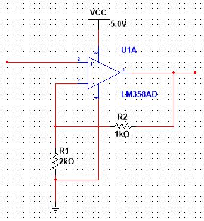

# [正经向]如何使用STM32播放篮球视频  
## 第一步  
第一步当然是要先配置环境啦，opencv、KEIL都不会配怎么和大家一起打篮球  
<div align="center"></div>

## 第二步
首先我们要知道一张图片是像素点阵组成的，经过各种的编码压缩方式就变成了常说的jpg,png,gif。视频是由一帧帧图片组成的，也是有特定的编码压缩方式。想要解码视频运算量还是挺大的，通常使用硬件解码（硬解），在STM32里面挺难完成。所以我们要把视频中每一帧的图片拿出来，再用比较简单的编码方式写进文件，然后在STM32中读取。  
首先我们打开一个篮球视频  
```c++
VideoCapture cap("CXK.mp4");
```
我们做一个循环，每隔0.1秒读取一张图片
```c++
Mat frame;
int index=0;
while (cap.read(frame)){
    imshow("cxk",frame);
    index++;
    cap.set(CAP_PROP_POS_MSEC ,100 * index);
    waitKey(100);
}
```
这里cap.set(CAP_PROP_POS_MSEC ,100 * index);把视频的时间位置指向100 * index ms处  
什么，原视频的16:9，显示屏是4:3，比例不对？那我们进行一下裁剪  
```c++
void resize(Mat&img){
	resize(img,img,Size(426,240));
	img=img(Rect(53,0,320,240));
}
```
还有一点就是某宝买到的LCD屏幕都是16位rgb的，我们屏幕上面显示的真彩色是24位的，所以还要进行转换。  
```c++
cvtColor(frame,frame_16bits,COLOR_BGR2BGR565);
```
然后再按照行->列的读取顺序把每一帧的图片信息写进文件，再把文件放进SD卡

## 第三步
什么，没有声音？没有鸡你太美的篮球视频是没有灵魂的——鲁迅。  
<div align="center"></div>  

其实音频文件里面的数据，是一连串的模拟值，经过压缩编码后变成了mp3什么的。我们用最简单的编码方式(PCM)的文件，将数据读出来，将图片和音频整合在文件中，就能同步播放视频和图片啦！！！  
首先一个wav文件的文件头是这样的。
```c++
__attribute__((packed)) struct WavHead{
	int8_t RIFF[4];
	int32_t filesize;
	int8_t WAVE[4];
	int8_t FMT[4];

	int32_t size1;
	int16_t fmttag;//1
	int16_t channel;//1
	int32_t samplespersec;//每秒采样数
	int32_t bytepersec;
	int16_t blockalign;
	int16_t bitpersamples;
	int8_t DATA[4];
	int32_t datasize;
};
```
什么看不懂？别管那么多，我们要的是datasize和samplespersec（这里的音频文件为了方便处理，通过软件转成了16位深，16000hz采样率（即256kbps)，单声道）。datasize即后面的数据的总字节数量，samplespersec即采样率。  
然后只需要在每一帧的循环里面，写入音频的数据：每0.1s采样1600个16位值，即3200字节。写入图像数据：320 * 240 * 2个字节。  
这样我们就完成了视频文件的预处理啦！！！  
<div align="center"></div>

## 第四步
终于来到最重要的一步了，什么不会Stm32？会抄就行了。
<div align="center"></div>

首先我们先拿到一份卖家提供的非常完善的示例代码，里面以及包含了各种基本功能的实现，我们需要的是LCD屏幕、SD卡读写部分的示例代码。  
什么卖家没给你示例代码？在这里我教大家一个找硬件文档的万能方法：淘宝。将你手上的电子器件型号输入淘宝，随意点进一个卖家，在商品介绍一般都有很显眼的某度网盘的链接，懂了吧？  
我们将lcd屏幕初始化，usart初始化，sd卡初始化等一系列看不懂的初始化放在一起。然后我们需要知道的有这么几个。  
1、SD卡文件读取，卖家给的实例代码一般会封装好的，sd卡初始化之后的操作就和我们在windows下写的控制台(就是那个黑窗)的文件读写操作时一样的。  
2、在lcd屏幕显示图片，这个商家也封装好的，调用个函数，传进去显示图片的位置，还有储存图片像素的数组就能显示图片。  
3、定时器、时钟、dac，这是用来同步播放音乐的，我们把音频数据从文件读入之后，通过中断把音频文件通过dac播放。因为单片机是没有负电压得，所以使用2个dac输出，产生电压差。  
那么显示一帧图片的时序是这样的：  
开启一个计时器计数->从文件读入3200byte(16000hz / 10 * 2)的音频数据->定时器中断函数发现音频数据长度大于0，之后的中断开始循环输出音频数据，输出完将音频数据长度置0->从文件读完音频数据后同时读图片数据，显示在显示屏中->通过计时器判断这一帧图片的显示时间是否满100ms，然后开始下一帧的显示。  
代码量挺多的就不贴上来了，文章最后会放出全部代码的github链接，反正，我们只是代码的搬运工。  
搞完上面的代码后我们就能很清晰地播放篮球视频，但是发现声音不对劲，太小了。dac的驱动是3.3v，学过简单的电路就知道，下面是一个肥肠简单的信号放大电路。  
<div align="center"></div>

如果想要输入电压3.3v，输出电压5v，那么1.7R1=3.3R2  
那么随缘R1=2kΩ R2=1kΩ吧
使用运放的话输出电流还是挺小的，作者手上暂时只有一个蜂鸣器，全损音质，几乎听不出那句熟悉的鸡你太美，不过这个思路应该是对的，这个电流应该是可以驱动一个耳机。如果想要实现广场舞那种震撼感，自行实现放大电路吧。
